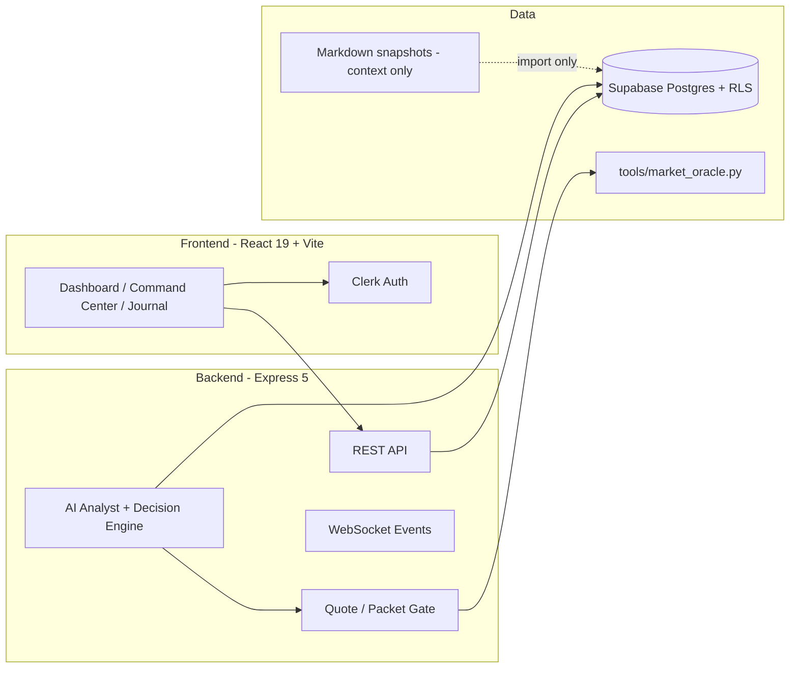

# Architecture

High-level system view for MyPortStock — a personal investment OS with verified market data, multi-agent analysis, and a dark-terminal web UI.

## System context



## Monorepo layout

| Path | Role |
|---|---|
| `frontend/` | React 19 SPA, Vite 8, Tailwind, Clerk React |
| `backend/` | Express API, decision engine, quote gate, WebSocket |
| `supabase/migrations/` | Schema + RLS migrations (source of truth) |
| `tools/` | Python market oracle and helpers |
| Root markdown | Investment orchestration (`AGENTS.md`, journals, memory index) |
| `docs/` | Engineering docs, ADRs, plans |
| `artifacts/` | Generated screenshots, reports (not canonical) |

## Runtime principles

1. **Supabase is runtime source of truth** for holdings, journal, watchlists, preferences ([ADR 0001](adr/0001-supabase-runtime-source-of-truth.md)).
2. **Per-user isolation** via Clerk `user_id` + RLS ([ADR 0002](adr/0002-clerk-user-isolation-rls.md)).
3. **Verified data packet** — sub-agents must not fetch prices independently ([ADR 0003](adr/0003-subagent-autonomous-search.md)).
4. **Fail closed** — missing data → `INSUFFICIENT_DATA` / `Wait`, not mock rows.
5. **Markdown** (`stock_portfolio.md`, `trade_journal.md`) is hypothesis/history context until refreshed.

## Request flow (analysis)

1. User authenticates (Clerk JWT).
2. Frontend calls `/api/packet/:ticker` or `/api/analyze`.
3. Backend builds quote packet through two-source acceptance gate.
4. Python oracle + decision engine enrich fundamentals/technicals.
5. Response includes decision snapshot, gate status, and agent-weighted scores.

## Frontend architecture

- Route-level pages under `frontend/src/pages/`
- Shared primitives `frontend/src/components/ui/`
- Data hooks (`useApi`, `useCommandCenter`, etc.) — authenticated fetch only
- CSS: design tokens in `frontend/src/styles/tokens.css` — see [DESIGN.md](DESIGN.md)
- Dev proxy: `/api` → `http://127.0.0.1:8080`

## Backend architecture

- Entry: `backend/server.js` — middleware, static `frontend/dist`, top-level routes
- Router: `backend/src/routes/api.js` — holdings, watchlists, journal, preferences, today
- Services: quote enrichment, market data, AI analyst, decision engine
- Auth: `backend/src/auth/requestAuth.js` — Clerk + dev bypass guardrails

## Investment logic boundary

Orchestrator rules live in root `AGENTS.md` / `ELITE_INVESTOR_SOP.md`, not in this file. Code changes that affect buy/sell gates must update tests in `backend/tests/decisionEngine.test.js` and related frontend contract tests.

## Verification

```bash
npm run build
npm test
npm run verify:architecture --workspace=frontend
```
