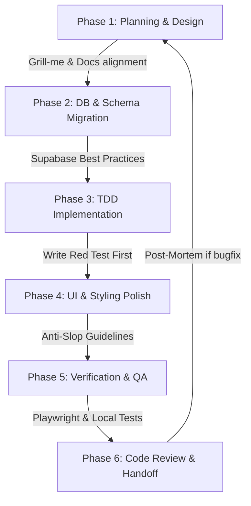

# MyPortStock: Developer Skills Workflow Guide

เอกสารฉบับนี้กำหนด **Workflow การพัฒนา** ร่วมกับ AI Agent โดยคัดเลือกเฉพาะ **Agent Skills** ที่มีอยู่และเหมาะสมกับเทคโนโลยีของโปรเจกต์ [MyPortStock](file:///Users/nopparuj/my-agents/MyPortStock) (React 19 + Vite, Express, Supabase PostgreSQL, Clerk Auth, Sentry, Vitest/Playwright) เพื่อให้การส่งมอบงานมีมาตรฐานและลดบั๊ก (Regression)

---

## 1. Project Technology Alignment & Relevant Skills

โปรเจกต์นี้มี Stack ที่ชัดเจน ซึ่งเราสามารถจับคู่กับ Skills ที่ระบบมีอยู่ได้ดังนี้:

| Domain | Tech Stack ในโปรเจกต์ | Relevant Installed Agent Skills | เหตุผลความจำเป็น / วิธีการใช้ |
| :--- | :--- | :--- | :--- |
| **Database** | Supabase, PostgreSQL, RLS | [supabase](file:///Users/nopparuj/.gemini/config/skills/supabase/SKILL.md), [supabase-postgres-best-practices](file:///Users/nopparuj/.gemini/config/skills/supabase-postgres-best-practices/SKILL.md) | ใช้เมื่อมี Schema change, เขียน RLS policies หรือทำ Database Migration |
| **Backend & Security** | Node.js, Express, Clerk, Shell Subprocess | `security-best-practices` | ตรวจจับ Command Injection (ต้องใช้ `execFile`/`spawn` ไม่ใช้ string interpolation) และคุม Clerk JWT authentication |
| **Frontend UI/UX** | React 19, Vite, Tailwind CSS, Lucide | [vercel-react-best-practices](file:///Users/nopparuj/.gemini/config/skills/vercel-react-best-practices/SKILL.md), [vercel-composition-patterns](file:///Users/nopparuj/.gemini/config/skills/vercel-composition-patterns/SKILL.md), [baseline-ui](file:///Users/nopparuj/.gemini/config/skills/baseline-ui/SKILL.md), [design-taste-frontend](file:///Users/nopparuj/.gemini/config/skills/design-taste-frontend/SKILL.md), [web-design-guidelines](file:///Users/nopparuj/.gemini/config/skills/web-design-guidelines/SKILL.md), [shadcn](file:///Users/nopparuj/.gemini/config/skills/shadcn/SKILL.md) | ใช้ในการคุม Code Structure ของ React 19, การสร้าง Dynamic Layout และการขัดเกลา UI เพื่อป้องกัน AI-Slop (เช่น แสง Glow ฟุ่มเฟือย) |
| **Testing & Quality** | Vitest, Playwright | [tdd](file:///Users/nopparuj/.gemini/config/skills/tdd/SKILL.md), [playwright-cli](file:///Users/nopparuj/.gemini/config/skills/playwright-cli/SKILL.md), [qa](file:///Users/nopparuj/.gemini/config/skills/qa/SKILL.md) | บังคับใช้ TDD เขียน Red test ก่อนเขียนโค้ดจริง และรัน Playwright เพื่อ UAT Smoke Test |
| **Debugging** | Node/React Logs, Sentry | [debug-mantra](file:///Users/nopparuj/.gemini/config/skills/debug-mantra/SKILL.md), [diagnose](file:///Users/nopparuj/.gemini/config/skills/diagnose/SKILL.md), [sentry-cli](file:///Users/nopparuj/.gemini/config/skills/sentry-cli/SKILL.md) | ใช้เมื่อสืบค้นหาสาเหตุของบั๊ก และเขียน Post-Mortem หลังแก้เสร็จ |
| **Planning & Review** | Markdown context, git flow | [grill-me](file:///Users/nopparuj/.gemini/config/skills/grill-me/SKILL.md), [grill-with-docs](file:///Users/nopparuj/.gemini/config/skills/grill-with-docs/SKILL.md), [review](file:///Users/nopparuj/.gemini/config/skills/review/SKILL.md), [post-mortem](file:///Users/nopparuj/.gemini/config/skills/post-mortem/SKILL.md) | ออกแบบ RFC/Plan ร่วมกับผู้ใช้ ตรวจสอบความถูกต้องของสถาปัตยกรรมก่อน Merge |

---

## 2. End-to-End Development Workflow

กระบวนการพัฒนาฟีเจอร์หรือการแก้บั๊กใน MyPortStock จะอิงตาม **6-Phase Workflow** ต่อไปนี้:



### Phase 1: Planning, Design & Discovery
* **Objective:** เคลียร์เป้าหมายการเปลี่ยนแปลงสถาปัตยกรรมหรือฟีเจอร์ใหม่
* **Skills ในการรัน:** `grill-me` (หรือ `/grill-me`), `grill-with-docs`
* **การปฏิบัติ:** 
  1. สัมภาษณ์ผู้ใช้เพื่อจำกัดสโคปการตัดสินใจ (Decision boundaries)
  2. อ่านลำดับไฟล์สำคัญตาม [AGENTS.md](file:///Users/nopparuj/my-agents/MyPortStock/AGENTS.md) เสมอ เริ่มจาก [CONTEXT.md](file:///Users/nopparuj/my-agents/MyPortStock/CONTEXT.md) -> [INVESTMENT_CIO_PERSONA.md](file:///Users/nopparuj/my-agents/MyPortStock/INVESTMENT_CIO_PERSONA.md) -> [ELITE_INVESTOR_SOP.md](file:///Users/nopparuj/my-agents/MyPortStock/ELITE_INVESTOR_SOP.md) -> [PROJECT_MEMORY_INDEX.md](file:///Users/nopparuj/my-agents/MyPortStock/PROJECT_MEMORY_INDEX.md)
  3. หากต้องการลง Skill พิเศษเพิ่มเติม ให้ใช้ `find-skills` เพื่อหาคุมเวอร์ชันและความปลอดภัยก่อนติดตั้ง

### Phase 2: Database & Schema Migration
* **Objective:** การเพิ่มหรือแก้ไขข้อมูลในตาราง Supabase
* **Skills ในการรัน:** `supabase`, `supabase-postgres-best-practices`
* **การปฏิบัติ:**
  1. ออกแบบ SQL Schema และระบุ RLS Policy เสมอ ป้องกันการรั่วไหลของข้อมูลระหว่าง Clerk `user_id` (Per-user Data Isolation)
  2. ใช้ชนิดข้อมูล `TIMESTAMP WITH TIME ZONE` (TIMESTAMPTZ) ใน Postgres เพื่อหลีกเลี่ยงความคลาดเคลื่อนของเวลาของตลาดหุ้น
  3. ตรวจสอบความถูกต้องของสิทธิ์ผ่าน SQL tests ก่อนนำไปใช้จริง

### Phase 3: Test-Driven Development (TDD) Implementation
* **Objective:** พัฒนาส่วน Logic หลัก ทั้ง Backend API และ Model การคำนวณราคา/Conviction Score
* **Skills ในการรัน:** `tdd`, `security-best-practices`
* **การปฏิบัติ:**
  1. วางแผนการทำ TDD (เขียน Plan ใน scratch หรือ plan.md)
  2. สร้าง RED test 1 เคสที่เป็น Public Interface (เช่น Endpoint `/api/portfolio` หรือโมดูลคำนวณ)
  3. ตรวจเช็ค **Security Guardrails**:
     - ห้ามใช้ `exec` หรือ string interpolation ในการเรียก Python script ให้ใช้ `execFile` หรือ `spawn` เท่านั้น
     - ต้อง validate input string regex เสมอ (เช่น ticker `^[A-Za-z0-9.-]{1,10}$`)
  4. เขียนโค้ดส่วนที่น้อยที่สุดเพื่อให้ได้ GREEN test จากนั้น refactor

### Phase 4: UI & Styling Polish
* **Objective:** พัฒนาหน้าตา React 19 Frontend ให้หรูหราสไตล์ Premium Dark Terminal และ Responsive
* **Skills ในการรัน:** `baseline-ui`, `design-taste-frontend`, `web-design-guidelines`, `shadcn`
* **การปฏิบัติ:**
  1. ใช้ CSS Variable ของ Theme สีโปรเจกต์ หลีกเลี่ยง Ad-hoc inline class
  2. นำกฎ **Anti-Slop** มาจับ: ห้ามใช้การเบลอหรือ Glassmorphism แบบพร่ำเพรื่อ, ห้ามขอบการ์ดมนเกินไป (Over-rounded), และให้ความสำคัญกับ Typography ที่อ่านง่าย
  3. ออกแบบปุ่มกดและ Input ให้มีสถานะ Active/Hover/Loading อย่างชัดเจน และรองรับ Mobile view (Responsive Stacking)

### Phase 5: Verification & QA
* **Objective:** ตรวจสอบความสมบูรณ์และทดสอบการใช้งานจริงบน Browser
* **Skills ในการรัน:** `playwright-cli`, `qa`
* **การปฏิบัติ:**
  1. ตรวจสอบว่า `npm run dev` สตาร์ทขึ้นทั้งคู่ และรัน `check:all` เพื่อรัน prettier, eslint, typecheck และ test
  2. เขียน UAT flow หรือเปิด Playwright เพื่อกดสุ่มดูสถานะ User Signed-in/Signed-out และการดึงข้อมูลจาก Supabase
  3. ปิดโอกาสบั๊กหลุดด้วยการเช็ค **False-Buy Checklist** ใน [AGENTS.md](file:///Users/nopparuj/my-agents/MyPortStock/AGENTS.md) หากเกี่ยวข้องกับตรรกะการวิเคราะห์หุ้น

### Phase 6: Code Review & Handoff
* **Objective:** ส่งมอบโค้ดด้วยความปลอดภัย และเก็บบันทึกสิ่งที่เรียนรู้
* **Skills ในการรัน:** `review`, `post-mortem`
* **การปฏิบัติ:**
  1. เรียกใช้ `review` เพื่อตรวจสอบความเข้ากันได้กับมาตรฐานโปรเจกต์และความปลอดภัยของความลับ (Secrets / Keys)
  2. หากการทำงานเป็นการแก้ไขบั๊กที่เกิดขึ้น ให้สร้างเอกสาร `post-mortem` เพื่อบันทึกสาเหตุทางเทคนิค ตัวตรวจจับ และแผนการป้องกัน
  3. อัปเดต `PROJECT_MEMORY_INDEX.md` แบบย่อ (3-6 บรรทัด) เพื่อบันทึกการตัดสินใจที่คงอยู่ของรอบพัฒนาการนั้นๆ

---

## 3. Dynamic Date & Price Safety Rules (Mandatory)

ไม่ว่าจะใช้ Skill ใดในการพัฒนาฟีเจอร์ที่แตะต้อง **การเงินหรือราคาหุ้น**:
- **ห้าม bypass Main Orchestrator:** ห้ามเขียน Sub-agent หรือโมดูลย่อยที่สามารถยิงค้นหาราคาตลาดหุ้นได้เอง ให้ใช้ verified packet เท่านั้น
- **การเช็คราคา:** ราคาล่าสุดต้องผ่าน `Current Price Acceptance Gate` (อิง Tier 1 หรือ Tier 2 เท่านั้น ห้ามสรุปจาก AI Snippets หรือ Fair Value ของ Analyst)
- **วันที่:** ห้ามใช้ "วันนี้" ใน markdown ในการสรุปค่า วันเวลาต้องอ้างอิงจาก active session context เสมอ

---

> [!TIP]
> **การเรียกใช้งาน:** หากกำลังจะเริ่มต้นทำ Task ใหม่ที่มีความซับซ้อน แนะนำให้พิมพ์เรียกทาสก์โดยระบุ Workflow เช่น: *"ต้องการทำฟีเจอร์ X โดยอิงตาม Phase 1: Planning ด้วย skill /grill-me"* เป็นต้น เพื่อให้ Agent ดำเนินการตามลำดับขั้นตอนได้อย่างถูกต้อง

## 4. Verification

To verify that the development workflow tooling, dependencies, and test checks remain fully compliant, run the monorepo-wide checks:
```bash
npm run check:all
```
