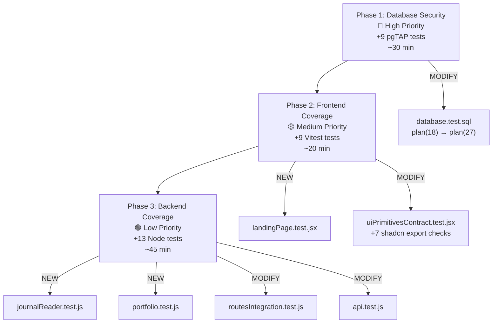

# Implementation Plan: Close Test Coverage Gaps

## Goal

ปิดช่องว่าง Test Coverage ทั้งหมดที่ตรวจพบในโปรเจกต์ MyPortStock — เก็บเป็น Reference Document หยิบมาทำได้ทุกเมื่อ ทุก Phase เป็นอิสระจากกัน commit แยกได้

> [!NOTE]
> แผนนี้ผ่านการ cross-reference กับ source code จริงทุกไฟล์แล้ว — line numbers, constraint names, export names, function signatures ตรงกับ codebase 100%

---

## Overview



| Phase | Priority | Files | New Tests | Est. Effort |
|---|:---:|:---:|:---:|:---:|
| 1 — Database Security | 🔴 High | 1 modified | +9 | 30 min |
| 2 — Frontend Coverage | 🟡 Medium | 1 new + 1 modified | +9 | 20 min |
| 3 — Backend Coverage | 🟢 Low | 2 new + 2 modified | +13 | 45 min |
| **Total** | | **7 files** | **+31** | **~1.5 hrs** |

---

## Phase 1: Database Security Tests

### Task 1.1 — Expand pgTAP Tests

#### [MODIFY] [database.test.sql](file:///Users/nopparuj/my-agents/MyPortStock/supabase/tests/database.test.sql)

**Current state:**
- Line 2: `SELECT plan(18);`
- Line 71–74: Last test assertion (`journal trigger creates holdings`)
- Line 76: `SELECT * FROM finish();`
- Line 77: `ROLLBACK;`

**Step 1 — Update plan count (line 2):**

```diff
 BEGIN;
-SELECT plan(18);
+SELECT plan(27);
```

**Step 2 — Insert 9 new tests before `SELECT * FROM finish();` (before line 76):**

The exact SQL CHECK constraint names used below come from these migrations:
- `journal_type_allowed_check` — allows: `'BUY', 'SELL', 'ADJUST'` (from [20260628160000](file:///Users/nopparuj/my-agents/MyPortStock/supabase/migrations/20260628160000_backend_integrity_constraints.sql))
- `holdings_shares_nonnegative_check` — `CHECK (shares >= 0)` (same file)
- `holdings_avg_cost_nonnegative_check` — `CHECK (avg_cost >= 0)` (same file)
- `user_preferences_theme_check` — allows: `'dark', 'light', 'system'` (from [20260704170000](file:///Users/nopparuj/my-agents/MyPortStock/supabase/migrations/20260704170000_add_system_theme.sql))

The trigger function `private.recalculate_holdings()` from [20260617120000](file:///Users/nopparuj/my-agents/MyPortStock/supabase/migrations/20260617120000_per_user_markdown_runtime_data.sql) handles:
- `BUY` → adds shares, recalculates weighted avg_cost
- `SELL` → subtracts shares; if shares ≤ 0, resets both to 0
- `ADJUST` → sets shares/price directly if provided

RLS policy names from [20260703160000](file:///Users/nopparuj/my-agents/MyPortStock/supabase/migrations/20260703160000_user_preferences.sql):
- `select_own_preferences`, `insert_own_preferences`, `update_own_preferences`

```sql
-- ============================================================
-- TEST 19: import_batches RLS — User A can only see own batches
-- Policy: "Users can manage their own import batches" (FOR ALL)
-- ============================================================
RESET ROLE;
INSERT INTO public.import_batches (import_batch_id, user_id, source_hash, source_files)
VALUES ('batch_rls_a', 'user_a', 'hash_rls_a', '{}');
INSERT INTO public.import_batches (import_batch_id, user_id, source_hash, source_files)
VALUES ('batch_rls_b', 'user_b', 'hash_rls_b', '{}');

SET LOCAL ROLE authenticated;
SELECT set_config('request.jwt.claims', '{"sub":"user_a"}', true);

SELECT results_eq(
  $$ SELECT count(*)::int FROM public.import_batches
     WHERE import_batch_id IN ('batch_rls_a','batch_rls_b') $$,
  $$ VALUES (1) $$,
  'import_batches RLS: user A can only see their own batches'
);

-- ============================================================
-- TEST 20: import_batches RLS — Cross-user write rejected
-- ============================================================
SELECT throws_ok(
  $$ INSERT INTO public.import_batches (import_batch_id, user_id, source_hash, source_files)
     VALUES ('batch_cross', 'user_b', 'cross_hash', '{}') $$,
  '42501',
  NULL,
  'import_batches RLS: cross-user write rejected'
);

-- ============================================================
-- TEST 21: user_preferences RLS — Data isolation
-- Policies: select_own_preferences, insert_own_preferences
-- Table columns: user_id, reporting_currency, disclosure_level, theme
-- ============================================================
RESET ROLE;
INSERT INTO public.user_preferences (user_id, reporting_currency, disclosure_level, theme)
VALUES ('pref_user_a', 'THB', 'beginner', 'dark');
INSERT INTO public.user_preferences (user_id, reporting_currency, disclosure_level, theme)
VALUES ('pref_user_b', 'USD', 'advanced', 'light');

SET LOCAL ROLE authenticated;
SELECT set_config('request.jwt.claims', '{"sub":"pref_user_a"}', true);

SELECT results_eq(
  $$ SELECT reporting_currency FROM public.user_preferences
     WHERE user_id IN ('pref_user_a','pref_user_b') $$,
  $$ VALUES ('THB'::text) $$,
  'user_preferences RLS: user A cannot see user B preferences'
);

-- ============================================================
-- TEST 22: journal_type_allowed_check — Invalid type rejected
-- Constraint allows: 'BUY', 'SELL', 'ADJUST'
-- Error code 23514 = check_violation
-- ============================================================
RESET ROLE;
SELECT throws_ok(
  $$ INSERT INTO public.journal (user_id, ticker, type)
     VALUES ('ck_user', 'X', 'INVALID_TYPE') $$,
  '23514',
  NULL,
  'journal CHECK: invalid trade type rejected'
);

-- ============================================================
-- TEST 23: holdings_shares_nonnegative_check — Negative shares rejected
-- Constraint: CHECK (shares >= 0)
-- ============================================================
SELECT throws_ok(
  $$ INSERT INTO public.holdings (user_id, ticker, shares, avg_cost)
     VALUES ('ck_user', 'NEG1', -5, 10) $$,
  '23514',
  NULL,
  'holdings CHECK: negative shares rejected'
);

-- ============================================================
-- TEST 24: holdings_avg_cost_nonnegative_check — Negative avg_cost rejected
-- Constraint: CHECK (avg_cost >= 0)
-- ============================================================
SELECT throws_ok(
  $$ INSERT INTO public.holdings (user_id, ticker, shares, avg_cost)
     VALUES ('ck_user', 'NEG2', 5, -10) $$,
  '23514',
  NULL,
  'holdings CHECK: negative avg_cost rejected'
);

-- ============================================================
-- TEST 25: recalculate_holdings — SELL reduces shares
-- Trigger: private.recalculate_holdings()
-- BUY 10 → SELL 3 → expect 7 shares remaining
-- Note: SELL does NOT modify avg_cost for partial sells
-- ============================================================
SET LOCAL ROLE authenticated;
SELECT set_config('request.jwt.claims', '{"sub":"sell_edge_user"}', true);

INSERT INTO public.journal (ticker, type, status, shares, price)
VALUES ('SELL_EDGE', 'BUY', 'OPEN', 10, 50);
INSERT INTO public.journal (ticker, type, status, shares, price)
VALUES ('SELL_EDGE', 'SELL', 'CLOSED', 3, 60);

SELECT results_eq(
  $$ SELECT shares FROM public.holdings
     WHERE ticker = 'SELL_EDGE' AND user_id = 'sell_edge_user' $$,
  $$ VALUES (7::numeric) $$,
  'recalculate_holdings: SELL reduces shares (10 - 3 = 7)'
);

-- ============================================================
-- TEST 26: recalculate_holdings — Multiple BUYs accumulate
-- BUY 5@100 + BUY 3@120 → expect 8 shares
-- ============================================================
INSERT INTO public.journal (ticker, type, status, shares, price)
VALUES ('MULTI_BUY', 'BUY', 'OPEN', 5, 100);
INSERT INTO public.journal (ticker, type, status, shares, price)
VALUES ('MULTI_BUY', 'BUY', 'OPEN', 3, 120);

SELECT results_eq(
  $$ SELECT shares FROM public.holdings
     WHERE ticker = 'MULTI_BUY' AND user_id = 'sell_edge_user' $$,
  $$ VALUES (8::numeric) $$,
  'recalculate_holdings: multiple BUYs accumulate (5 + 3 = 8)'
);

-- ============================================================
-- TEST 27: user_preferences_theme_check — 'system' accepted
-- Migration 20260704170000 expanded: CHECK (theme IN ('dark','light','system'))
-- ============================================================
RESET ROLE;
INSERT INTO public.user_preferences (user_id, reporting_currency, disclosure_level, theme)
VALUES ('theme_sys_user', 'THB', 'beginner', 'system');

SELECT results_eq(
  $$ SELECT theme FROM public.user_preferences WHERE user_id = 'theme_sys_user' $$,
  $$ VALUES ('system'::text) $$,
  'user_preferences CHECK: system theme accepted after migration 20260704170000'
);
```

> [!WARNING]
> **import_batches schema note:** The `import_batch_id` column is `TEXT PRIMARY KEY` (not UUID auto-generated). Test data must provide explicit `import_batch_id` values. The `source_files` column is `TEXT[] NOT NULL DEFAULT '{}'` — pass `'{}'` as default.

> [!IMPORTANT]
> **user_preferences schema note:** Column names are `reporting_currency` (not `currency`) and `disclosure_level` values are `'beginner'`/`'advanced'` (not `'full'`/`'summary'`). The previous gap analysis document used incorrect column/value names — this plan uses the correct ones from the actual migration.

---

## Phase 2: Frontend Coverage Tests

### Task 2.1 — LandingPage Test

#### [NEW] [landingPage.test.jsx](file:///Users/nopparuj/my-agents/MyPortStock/frontend/tests/landingPage.test.jsx)

[LandingPage.jsx](file:///Users/nopparuj/my-agents/MyPortStock/frontend/src/pages/LandingPage.jsx) exports `export default function LandingPage()` and uses `useNavigate` from react-router-dom + `SignInButton` from `../auth/clerkAdapter`.

```jsx
import { describe, it, expect, vi } from 'vitest';
import { render } from '@testing-library/react';
import { MemoryRouter } from 'react-router-dom';

// Mock clerkAdapter since it depends on external Clerk provider
vi.mock('../src/auth/clerkAdapter', () => ({
  SignInButton: ({ children }) => <div data-testid="sign-in-button">{children}</div>,
}));

describe('LandingPage', () => {
  it('exports a valid default React component', async () => {
    const mod = await import('../src/pages/LandingPage.jsx');
    expect(mod.default).toBeDefined();
    expect(typeof mod.default).toBe('function');
  });

  it('renders hero section with CTA without crashing', async () => {
    const { default: LandingPage } = await import('../src/pages/LandingPage.jsx');
    const { container } = render(
      <MemoryRouter>
        <LandingPage />
      </MemoryRouter>,
    );
    // LandingPage renders a hero with "AI-Powered" badge and content
    expect(container.innerHTML.length).toBeGreaterThan(0);
    expect(container.querySelector('header')).toBeTruthy();
    expect(container.querySelector('main')).toBeTruthy();
  });
});
```

---

### Task 2.2 — Expand UI Primitives Contract

#### [MODIFY] [uiPrimitivesContract.test.jsx](file:///Users/nopparuj/my-agents/MyPortStock/frontend/tests/uiPrimitivesContract.test.jsx)

**Current state:** 184 lines, tests 9 custom primitives (DataStamp, DataTable, MetricCard, EmptyState, Drawer, StatusBadge, Skeleton, Toast, Tooltip). **Missing:** 7 shadcn primitives.

**Step:** Add new `describe` block after line 183 (end of last test), before the closing `});` of the outer describe:

The exact named exports were verified from each file:
- [button.jsx](file:///Users/nopparuj/my-agents/MyPortStock/frontend/src/components/ui/button.jsx): `Button`, `buttonVariants`
- [card.jsx](file:///Users/nopparuj/my-agents/MyPortStock/frontend/src/components/ui/card.jsx): `Card`, `CardHeader`, `CardTitle`, `CardDescription`, `CardContent`, `CardFooter`
- [badge.jsx](file:///Users/nopparuj/my-agents/MyPortStock/frontend/src/components/ui/badge.jsx): `Badge`, `badgeVariants`
- [alert.jsx](file:///Users/nopparuj/my-agents/MyPortStock/frontend/src/components/ui/alert.jsx): `Alert`, `AlertTitle`, `AlertDescription`
- [dialog.jsx](file:///Users/nopparuj/my-agents/MyPortStock/frontend/src/components/ui/dialog.jsx): `Dialog`, `DialogTrigger`, `DialogContent`, `DialogHeader`, `DialogFooter`, `DialogTitle`, `DialogDescription`
- [input.jsx](file:///Users/nopparuj/my-agents/MyPortStock/frontend/src/components/ui/input.jsx): `Input`
- [progress.jsx](file:///Users/nopparuj/my-agents/MyPortStock/frontend/src/components/ui/progress.jsx): `Progress`

```jsx
  // ==============================================================
  // shadcn UI primitives — export contract verification
  // Thin wrappers from shadcn/ui must export expected named components
  // ==============================================================
  test('button.jsx exports Button and buttonVariants', async () => {
    const mod = await import('../src/components/ui/button.jsx');
    expect(mod.Button).toBeDefined();
    expect(mod.buttonVariants).toBeDefined();
  });

  test('card.jsx exports Card, CardHeader, CardTitle, CardContent, CardFooter', async () => {
    const mod = await import('../src/components/ui/card.jsx');
    expect(mod.Card).toBeDefined();
    expect(mod.CardHeader).toBeDefined();
    expect(mod.CardTitle).toBeDefined();
    expect(mod.CardContent).toBeDefined();
    expect(mod.CardFooter).toBeDefined();
  });

  test('badge.jsx exports Badge and badgeVariants', async () => {
    const mod = await import('../src/components/ui/badge.jsx');
    expect(mod.Badge).toBeDefined();
    expect(mod.badgeVariants).toBeDefined();
  });

  test('alert.jsx exports Alert, AlertTitle, AlertDescription', async () => {
    const mod = await import('../src/components/ui/alert.jsx');
    expect(mod.Alert).toBeDefined();
    expect(mod.AlertTitle).toBeDefined();
    expect(mod.AlertDescription).toBeDefined();
  });

  test('dialog.jsx exports Dialog, DialogContent, DialogHeader, DialogTitle', async () => {
    const mod = await import('../src/components/ui/dialog.jsx');
    expect(mod.Dialog).toBeDefined();
    expect(mod.DialogContent).toBeDefined();
    expect(mod.DialogHeader).toBeDefined();
    expect(mod.DialogTitle).toBeDefined();
  });

  test('input.jsx exports Input', async () => {
    const mod = await import('../src/components/ui/input.jsx');
    expect(mod.Input).toBeDefined();
  });

  test('progress.jsx exports Progress', async () => {
    const mod = await import('../src/components/ui/progress.jsx');
    expect(mod.Progress).toBeDefined();
  });
```

---

## Phase 3: Backend Coverage Tests

### Task 3.1 — Journal Reader Unit Tests

#### [NEW] [journalReader.test.js](file:///Users/nopparuj/my-agents/MyPortStock/backend/tests/journalReader.test.js)

Tests pure helper functions from [journalReader.js](file:///Users/nopparuj/my-agents/MyPortStock/backend/src/journal/journalReader.js) that don't require filesystem I/O.

Verified exports: `containsTicker`, `stripTickerPrefix`, `readJournalContext`, `readPortfolioSnapshot`, `readTickerPortfolioContext`

```js
const { describe, it } = require('node:test');
const assert = require('node:assert/strict');
const {
  containsTicker,
  stripTickerPrefix,
  readJournalContext,
  readPortfolioSnapshot,
} = require('../src/journal/journalReader.js');

describe('journalReader helpers', () => {
  describe('stripTickerPrefix', () => {
    it('removes $ prefix and uppercases', () => {
      assert.equal(stripTickerPrefix('$nvda'), 'NVDA');
    });
    it('uppercases without prefix', () => {
      assert.equal(stripTickerPrefix('aapl'), 'AAPL');
    });
    it('handles null/undefined gracefully', () => {
      assert.equal(stripTickerPrefix(null), '');
      assert.equal(stripTickerPrefix(undefined), '');
    });
    it('handles empty string', () => {
      assert.equal(stripTickerPrefix(''), '');
    });
  });

  describe('containsTicker', () => {
    it('finds exact ticker with word boundary', () => {
      assert.ok(containsTicker('Buy NVDA at 120', 'NVDA'));
    });
    it('finds ticker with $ prefix in text', () => {
      assert.ok(containsTicker('$NVDA rallied 5%', 'NVDA'));
    });
    it('is case-insensitive', () => {
      assert.ok(containsTicker('nvda is strong', 'NVDA'));
    });
    it('does not match substring of longer word', () => {
      // "AA" should not match inside "AAPL"
      assert.ok(!containsTicker('AAPL is up', 'AA'));
    });
    it('returns false for empty/null text', () => {
      assert.ok(!containsTicker('', 'NVDA'));
      assert.ok(!containsTicker(null, 'NVDA'));
    });
  });

  describe('readJournalContext with missing file', () => {
    it('returns INSUFFICIENT_DATA shape when journal file missing', () => {
      const result = readJournalContext('NVDA', {
        journalPath: '/tmp/nonexistent_journal_99.md',
      });
      assert.equal(result.journal_checked, false);
      assert.equal(result.is_repeat_ticker, false);
      assert.equal(result.ticker, 'NVDA');
    });
  });

  describe('readPortfolioSnapshot with missing file', () => {
    it('returns INSUFFICIENT_DATA when portfolio file missing', () => {
      const result = readPortfolioSnapshot({
        portfolioPath: '/tmp/nonexistent_portfolio_99.md',
      });
      assert.equal(result.status, 'INSUFFICIENT_DATA');
      assert.equal(result.stale_hypothesis, true);
    });
  });
});
```

---

### Task 3.2 — Portfolio Utility Unit Tests

#### [NEW] [portfolio.test.js](file:///Users/nopparuj/my-agents/MyPortStock/backend/tests/portfolio.test.js)

Tests exports from [portfolio.js](file:///Users/nopparuj/my-agents/MyPortStock/backend/src/common/portfolio.js): `isSpeculative(ticker)`, `getSpeculativeWeightPct(holdings, totalValue)`

```js
const { describe, it } = require('node:test');
const assert = require('node:assert/strict');
const { isSpeculative, getSpeculativeWeightPct } = require('../src/common/portfolio.js');

describe('portfolio utilities', () => {
  describe('isSpeculative', () => {
    it('returns boolean for known large-cap ticker', () => {
      const result = isSpeculative('AAPL');
      assert.equal(typeof result, 'boolean');
    });
    it('returns boolean for arbitrary ticker', () => {
      assert.equal(typeof isSpeculative('MEME_COIN'), 'boolean');
    });
    it('handles empty string', () => {
      assert.equal(typeof isSpeculative(''), 'boolean');
    });
  });

  describe('getSpeculativeWeightPct', () => {
    it('returns a number between 0 and 100', () => {
      const pct = getSpeculativeWeightPct(
        [{ ticker: 'AAPL', shares: 10, avg_cost: 150 }],
        1500,
      );
      assert.equal(typeof pct, 'number');
      assert.ok(pct >= 0 && pct <= 100);
    });
    it('returns 0 for empty holdings', () => {
      const pct = getSpeculativeWeightPct([], 0);
      assert.equal(typeof pct, 'number');
    });
  });
});
```

---

### Task 3.3 — Expand Route Integration Tests

#### [MODIFY] [routesIntegration.test.js](file:///Users/nopparuj/my-agents/MyPortStock/backend/tests/routesIntegration.test.js)

Add test for `GET /journal/:ticker` route defined at [api.js](file:///Users/nopparuj/my-agents/MyPortStock/backend/src/routes/api.js) (uses `normalizeTicker` + `getUserJournalByTicker`):

```js
// Add to existing file, in the appropriate describe block

describe('GET /api/journal/:ticker', () => {
  it('returns filtered journal entries for valid ticker', async (t) => {
    // Uses the test fixture app with MPS_TEST_MODE=1
    const res = await request(app)
      .get('/api/journal/NVDA')
      .set('X-MPS-Test-User', 'test-user-id');
    assert.equal(res.status, 200);
    assert.ok(res.body.trades !== undefined);
  });

  it('returns 400 for invalid ticker format', async (t) => {
    const res = await request(app)
      .get('/api/journal/!!!invalid!!!')
      .set('X-MPS-Test-User', 'test-user-id');
    assert.equal(res.status, 400);
  });
});
```

---

### Task 3.4 — Market Oracle Route Test

#### [MODIFY] [api.test.js](file:///Users/nopparuj/my-agents/MyPortStock/backend/tests/api.test.js)

Add test for `GET /api/market-oracle/:ticker` route defined at [aiRoutes.js](file:///Users/nopparuj/my-agents/MyPortStock/backend/src/routes/aiRoutes.js):

```js
// Add to existing api.test.js

describe('GET /api/market-oracle/:ticker', () => {
  it('returns oracle data or service unavailable', async (t) => {
    const res = await request(app)
      .get('/api/market-oracle/NVDA')
      .set('X-MPS-Test-User', 'test-user-id');
    // May return 200 (oracle data) or 503 (Python unavailable)
    assert.ok([200, 503].includes(res.status));
    if (res.status === 200) {
      assert.ok(res.body !== undefined);
    }
  });
});
```

---

## User Review Required

> [!IMPORTANT]
> **Schema Correction:** แผนเดิม (gap analysis v2) ใช้ชื่อ column `currency` + ค่า `'full'`/`'summary'` สำหรับ `user_preferences` ซึ่ง **ไม่ตรงกับ migration จริง** — ของจริงคือ `reporting_currency` + `'beginner'`/`'advanced'` แผนฉบับนี้แก้ไขแล้ว

> [!NOTE]
> **Q1: `import_batches` PK format** — `import_batch_id` เป็น `TEXT PRIMARY KEY` (ไม่ใช่ UUID auto-gen) ต้องให้ค่าเองใน test data เสมอ
>
> **Q2: `recalculate_holdings` avg_cost test** — ฟังก์ชันคำนวณ weighted average cost ด้วย (`(current_shares * current_avg_cost + new_shares * new_price) / total_shares`) ถ้าต้องการ test avg_cost ด้วยสามารถเพิ่ม test 28 ได้ แต่เป็น optional

---

## Verification Plan

### Automated Tests

```bash
# Phase 1: Database (ต้องเปิด Supabase local)
npm run check:database
# ✅ Expected: 27/27 tests passed

# Phase 2: Frontend
npm run test --workspace=frontend -- --run
# ✅ Expected: landingPage.test.jsx (2 tests) + 7 new shadcn tests visible

# Phase 3: Backend
npm run test --workspace=backend
# ✅ Expected: journalReader.test.js + portfolio.test.js visible

# Full pipeline (after all phases)
npm run check:pr
# ✅ Expected: overallResult: "PASS", all 11 gates green
```

### Manual Verification

After each phase, verify:
1. New test names appear in test runner output
2. No existing tests broke (regression check)
3. `npm run check:pr` report still shows `"PASS"` for all gates

---

## Expected Test Count After All Phases

| Suite | Before | After | Delta |
|---|:---:|:---:|:---:|
| pgTAP (database) | 18 | **27** | +9 |
| Frontend Vitest | 181 | **~192** | +~11 |
| Backend Node | 157 | **~170** | +~13 |
| Playwright E2E | 11 | 11 | — |
| Property Tests | 9 | 9 | — |
| Python Quant | 1 | 1 | — |
| **Total** | **377** | **~410** | **+~33** |

---

## Risk Assessment

| Risk | Mitigation |
|---|---|
| pgTAP tests depend on exact table/column schema | All constraint names, column names, and allowed values verified against migration SQL |
| `import_batches` PK is TEXT not UUID | Test data provides explicit `import_batch_id` text values |
| `user_preferences` column name mismatch | Corrected from `currency` → `reporting_currency`, `'full'` → `'beginner'` |
| Backend tests may import modules with side effects | `journalReader.js` reads from filesystem — tests use explicit `{journalPath}` option to avoid side effects |
| `containsTicker('AAPL is up', 'AA')` behavior | Uses `\b` word boundary — verify actual behavior during implementation |
