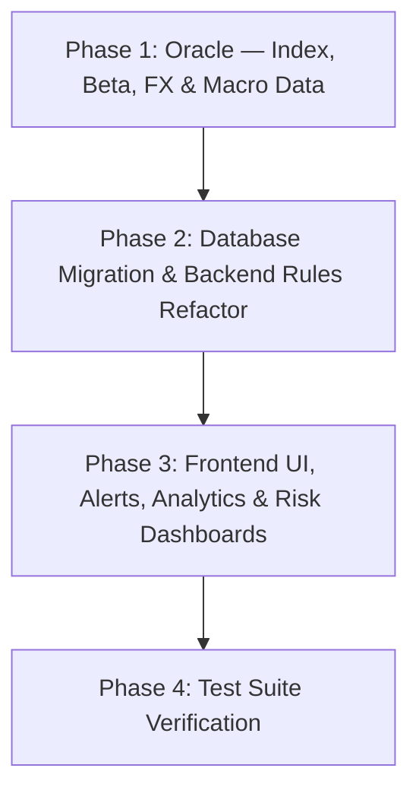

# Implementation Plan: Institutional Portfolio Risk & Macro Regime Refactor

This document outlines the step-by-step implementation plan for refactoring the stock analysis logic into a portfolio-aware, institutional-grade risk management system.

---

## 📌 Approved Design Decisions

We have aligned on the following structural decisions:

1.  **Decision Mode Resolution:**
    *   Query the user's portfolio via Supabase first. If the ticker is already held (`is_held: true`), default to `Existing Position / Exit Review`.
    *   If not held, fallback to `Swing Trade` (or allow manual override from UI).
2.  **Sector Concentration Limits (Sector Gate):**
    *   Enforce a maximum allocation of **30%** of total portfolio value per sector.
    *   If a sector's allocation exceeds 30%, new buy setups in that sector will trigger a **Soft Block**: the conviction score is capped at **5.0** and the verdict is forced to `Wait` (with a clear visual alert on the UI).
3.  **Macro Market Regime Filter (Risk-Off Gate):**
    *   Query the weekly trend of the **S&P 500 (`^GSPC`)** as the macro equity proxy.
    *   If the index price is below its weekly 200 EMA (Long-term Bearish), trigger **Dynamic Risk Budgeting**: reduce the individual trade risk budget (`hard_risk_thb`) by **50%** automatically (e.g., from 500 THB to 250 THB) and show a prominent warning.
4.  **Scale-In (Test vs. Confirmation) & Defense Zone Alerts:**
    *   Support a tiered entry model:
        *   **ไม้ 1 (Test Position - 30% size):** Entered at key defense zones (AVWAP / EMA20) without volume confirmation.
        *   **ไม้ 2 (Confirmation Position - 70% size):** Entered once the price reverses with volume validation (`zvr_ratio >= 1.5`).
5.  **Hypothetical Average Cost Calculator:**
    *   In the Scenario Planner and Trade Ticket components, display the estimated new average cost of a holding if the user adds shares:
        $$\text{Hypothetical Avg Cost} = \frac{(\text{Current Shares} \times \text{Current Avg Cost}) + (\text{New Shares} \times \text{New Buy Price})}{\text{Current Shares} + \text{New Shares}}$$
6.  **Automated Watchlist Scanner & Target Alerts:**
    *   Implement a background scanner that compares current prices of watchlist items against their dynamic entry zones (ไม้ 1).
    *   Display a prominent `🔔 Triggered Entry Zone` badge on the Dashboard and Watchlist panels when a stock falls within 1% of its support level.
7.  **Weighted Portfolio Beta Tracker:**
    *   Fetch beta coefficients for all assets in the portfolio dynamically.
    *   Calculate and display the Weighted Portfolio Beta on the Dashboard (e.g., `Portfolio Beta: 1.35 (Aggressive)`).
8.  **Cognitive Bias & Behavioral Loop Journal:**
    *   Add a `cognitive_bias` tag column to transaction logs to record the psychological state during trade entries (`FOMO`, `Loss Aversion`, `Anchoring`, `Herd Behavior`, `None`).
    *   Display a behavioral analysis chart on the Analytics page correlating specific biases with realized P/L losses.
9.  **Portfolio Drawdown Circuit Breaker:**
    *   Enforce the existing `maxPortfolioDrawdownPct` config (default 15%) as a **hard gate**.
    *   When total portfolio unrealized + realized P/L breaches the drawdown limit, **suspend all new buy orders** and display `🛑 DRAWDOWN LIMIT HIT — New buys suspended` until the portfolio recovers or the user manually resets.
10. **Position Time Stop (Dead Capital Recycling):**
    *   Track the number of calendar days since each position was opened.
    *   For `Swing Trade` positions: if held > **15 days** without reaching Target 1 or hitting Stop Loss, trigger a `⏰ Time Stop Review` alert prompting the user to exit or re-evaluate the thesis.
    *   For `Quick Trade` positions: threshold is **5 days**.
11. **Trailing Stop Logic (ATR-based Profit Lock):**
    *   After a position reaches Target 1, calculate a dynamic trailing stop: `Trailing Stop = Highest Close Since T1 − (ATR × 1.5)`.
    *   Display the trailing stop level on the Ticker Detail Page and update it daily.
    *   If the price closes below the trailing stop, trigger an `🔒 Trailing Stop Hit — Lock Profit` alert.
12. **Earnings Proximity Gate:**
    *   If the next earnings date is **≤ 5 calendar days** away, cap the maximum position size to **ไม้ 1 only (30% — Test Position)**.
    *   Display `⚠️ Earnings in X days — max 30% test position only` warning on the Trade Ticket and Decision Snapshot.
    *   Block ไม้ 2 (Confirmation 70%) until after earnings are reported.
13. **FX Risk Exposure Tracker (THB/USD):**
    *   Fetch the current THB/USD exchange rate from the oracle.
    *   Calculate and display **THB-Adjusted P/L** for all USD-denominated holdings alongside the raw USD P/L.
    *   Show the FX impact as a separate line item (e.g., `FX Impact: −1,200 THB (THB strengthened +2.1%)`) on the Portfolio Risk Page.

---

## 🛠️ Step-by-Step Implementation Roadmap



### Phase 1: Oracle — Index, Beta, FX & Macro Data
Modify `tools/market_oracle.py` to:
1.  Fetch weekly closing history for the S&P 500 index (`^GSPC`) and return `index_above_ema200` in the `macro` payload block.
2.  Fetch the individual stock's beta value from yfinance (`ticker.info.get('beta')`) and expose it as `beta` in the JSON metadata payload.
3.  Fetch the current **THB/USD exchange rate** (e.g., via `yfinance` ticker `THBUSD=X`) and return it as `fx_rate_thb_usd` in the payload.
4.  Ensure `earnings_date` is reliably returned (already partially implemented — verify consistency).
5.  Calculate the **ATR (14-period)** for use in Trailing Stop computations and return it as `atr_14` in the technical payload.

### Phase 2: Database Migration & Backend Rules Refactor
1.  **Database Migration:**
    *   Write a Supabase migration script under `supabase/migrations/` to:
        *   Add a `cognitive_bias` column (TEXT, CHECK constraint for allowed values) to the `journal` table.
        *   Add an `opened_at` column (TIMESTAMPTZ) to holdings/journal for Position Time Stop tracking.
2.  **Modify `backend/src/decision/decisionEngine.js`:**
    *   **Decision Mode Resolution:** Incorporate query lookups for `portfolio_context` and auto-resolve the mode.
    *   **Sector Concentration Gate:** Calculate sector concentrations and enforce the 5.0 score cap warning on breaches.
    *   **Macro Regime Filter:** Verify S&P 500 EMA200 weekly status and halve the allowed THB risk budget if bearish.
    *   **Portfolio Drawdown Circuit Breaker:** Compare total portfolio P/L % against `maxPortfolioDrawdownPct` config. If breached, block all new `Buy/Add` verdicts and inject a `DRAWDOWN_LIMIT_HIT` blocker.
    *   **Earnings Proximity Gate:** If `earnings_date` is ≤ 5 days from today, cap maximum position size to 30% (ไม้ 1 only) and add `EARNINGS_PROXIMITY` warning.
    *   **Trailing Stop Calculator:** After Target 1 is reached, compute `trailing_stop = highest_close_since_t1 - (atr_14 * 1.5)` and return it in the analysis response.
3.  **Modify Portfolio Service:**
    *   Implement **Weighted Portfolio Beta** calculation.
    *   Implement **THB-Adjusted P/L** by multiplying USD values by `fx_rate_thb_usd` and computing the FX impact delta.
    *   Implement **Position Time Stop Scanner:** query all open positions, compare `opened_at` against current date, flag positions exceeding the threshold (15 days Swing / 5 days Quick).
4.  **Implement Watchlist Scan Endpoint (`/api/watchlist/scan`):**
    *   Iterate over the user's watchlist, call the oracle, check if the price is within 1% of the support zones, and return the scan alert status.

### Phase 3: Frontend UI, Alerts, Analytics & Risk Dashboards
1.  **Modify `frontend/src/components/ScenarioPlanner.jsx` & `TradeTicket.jsx`:**
    *   Implement the **Hypothetical Average Cost** preview readout.
    *   Add a dropdown selector in the `TradeTicket` and `TradeLogDrawer` to log `cognitive_bias` values (`None`, `FOMO`, `Loss Aversion`, `Anchoring`, `Herd Behavior`).
2.  **Modify Dashboard UI:**
    *   Render the **Weighted Portfolio Beta** card inside the Portfolio KPI stats area.
    *   Render the `🔔 Triggered Entry Zone` badge on watchlist tickers when the background scanner returns active support zones.
    *   Render the `🛑 DRAWDOWN LIMIT HIT` banner at the top of Dashboard when the circuit breaker is active.
3.  **Modify Ticker Detail Page:**
    *   Display the **Dynamic Trailing Stop** level (updated daily) alongside the original hard stop when Target 1 has been reached.
    *   Display the **Earnings Proximity** warning badge with countdown when earnings are ≤ 5 days away.
4.  **Modify Portfolio Risk Page:**
    *   Add a **THB-Adjusted P/L** column and **FX Impact** line item showing the exchange rate effect on each holding.
    *   Add a **Position Age** column showing days held and highlighting positions that have exceeded their Time Stop threshold.
5.  **Modify Analytics UI:**
    *   Add a section for behavioral analytics (Cognitive Bias → P/L correlation chart).

### Phase 4: Test Suite Verification
1.  Add backend tests in `backend/tests/decisionEngine.test.js` to assert:
    *   Sector concentration $> 30\%$ caps score at 5.0 and verdict at `Wait`.
    *   `index_above_ema200 === false` halves the allowed THB risk budget.
    *   Portfolio Beta calculation is mathematically accurate.
    *   Drawdown > `maxPortfolioDrawdownPct` blocks all `Buy/Add` verdicts.
    *   Earnings ≤ 5 days caps position size to 30%.
    *   Trailing Stop calculation: `highest_close - (ATR × 1.5)` is correct.
    *   Position Time Stop flags positions exceeding threshold.
    *   THB-Adjusted P/L includes FX impact delta.
2.  Add frontend tests in `frontend/tests/dashboardComponents.test.jsx` to verify:
    *   The Hypothetical Average Cost renders correctly.
    *   The Cognitive Bias dropdown updates state on trade submissions.
    *   The Drawdown banner appears when the circuit breaker is active.
    *   The Trailing Stop and Earnings Proximity badges render on Ticker Detail.
    *   The FX Impact column renders on Portfolio Risk Page.

---

## 🔍 Verification

After completing these changes, run the following verification checks:

```bash
# Run backend tests to verify logic gates
npm test --workspace=backend

# Run frontend tests to verify UI calculations
npm test --workspace=frontend

# Verify entire monorepo compilation
npm run build
```
