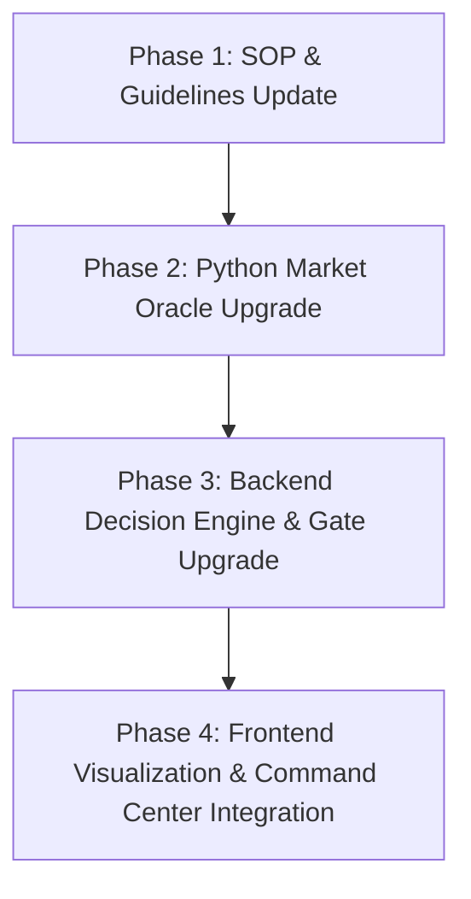

# Plan: Unbiased Institutional CIO Upgrade
> **Confidential · Institutional-Grade Decision Engine & AI Assistant Upgrade**

This plan details the design decisions and steps to implement the **Unbiased Institutional CIO** upgrade in the MyPortStock project. The goal is to evolve the AI assistant into an objective, debate-friendly analyst that uses institutional-grade fundamental filters, checks expectation gaps, and applies strict technical entry confluences.

---

## 📌 Approved Design Decisions

Following the `/grill-me` session, the following design paths have been selected and approved:

1. **Institutional Fundamental & Risk Metrics:**
   - Integrate **Piotroski F-Score** (9-point checklist of financial strength).
   - Integrate **Altman Z-Score** (credit/bankruptcy risk assessment).
   - Integrate **ROIC/ROCE** (Return on Capital Employed) to verify capital deployment efficiency.
2. **Unbiased Debate & Fail-Closed Logic:**
   - Enforce the **"Devil's Advocate"** rule: Every analysis must include at least 3 blindspots/bear points.
   - Challenge the Risk/Reward ratio as an emotional brake on all buy queries.
   - Strictly return `INSUFFICIENT_DATA` when core prices or indicators conflict or are missing, rather than guessing.
3. **Expectation vs. Reality Gap Audit:**
   - Compare actual earnings/revenue against Wall Street consensus (Expectation Gap).
   - Track forward guidance revisions and require at least two institutional source citations.
4. **Technical & Entry Execution:**
   - Introduce **Anchored VWAP (AVWAP)** from key catalyst dates (e.g., latest earnings release).
   - Harden the **Zanger Volume Ratio (ZVR)** gate to require a volume multiplier of at least **`1.5`** on daily rebound days.

---

## 🛠️ Step-by-Step Implementation Roadmap

### Phase 1: SOP & Guidelines Update (Immediate)
We will update the following markdown files to cement these rules as the source of truth:
*   [ELITE_INVESTOR_SOP.md](./ELITE_INVESTOR_SOP.md):
    *   Add Piotroski F-Score, Altman Z-Score, and ROCE metrics to **Dimension 3 (Financials)**.
    *   Add AVWAP and ZVR >= 1.5 requirements to **Dimension 5 (Technicals)** and **Step 3 (Daily Confluence)**.
*   [AGENTS.md](./AGENTS.md):
    *   Add rules for the **"Devil's Advocate"** 3-blindspot requirement, R/R debate gate, and strict `INSUFFICIENT_DATA` logic.
    *   Add the expectation-reality consensus gate.
*   [INVESTMENT_CIO_PERSONA.md](./INVESTMENT_CIO_PERSONA.md) & [CONTEXT.md](./CONTEXT.md):
    *   Hardcode the unbiased debate stance, requirement of two citations, and definition of "Expectation Gap".

### Phase 2: Python Market Oracle Upgrade
Modify [tools/market_oracle.py](./tools/market_oracle.py) to fetch and calculate:
1.  **Piotroski F-Score:** Run the 9 check items (Net income, ROA, Operating Cash Flow, Quality of Earnings, Leverage decrease, Liquidity increase, No share dilution, Gross margin increase, Asset turnover increase).
2.  **Altman Z-Score:** Calculate the standard $Z$-Score formula for public companies:
    $$Z = 1.2X_1 + 1.4X_2 + 3.3X_3 + 0.6X_4 + 0.999X_5$$
    *   $Z > 2.99$: Safe Zone
    *   $1.81 < Z < 2.99$: Gray Zone
    *   $Z < 1.81$: Distress Zone
3.  **ROCE:** Calculate $\text{EBIT} / (\text{Total Assets} - \text{Current Liabilities})$.
4.  **Anchored VWAP:** Calculate VWAP anchored from the latest earnings date.
5.  **ZVR Check:** Ensure `zvr_ratio >= 1.5` on rebound setups.

### Phase 3: Backend Decision Engine & Gate Upgrade
Modify files under `backend/src/`:
*   [backend/src/decision/decisionEngine.js](./backend/src/decision/decisionEngine.js): 
    *   Add validation check for Piotroski F-Score (require >= 7/9 for Core, >= 5/9 for Swing).
    *   Add Altman Z-Score check (forbid Core buy if Z-Score < 1.81).
    *   Integrate ROCE filter and enforce `zvr_ratio >= 1.5` for Daily Confluence Setup.
*   [backend/src/gates/priceGate.js](./backend/src/gates/priceGate.js):
    *   Harden the validation of dual-source quotes.
*   [backend/src/services/aiAnalyst.js](./backend/src/services/aiAnalyst.js):
    *   Format the prompt to force sub-agents to present 3 bear-case points (Devil's Advocate) and calculate the expectation gap.

### Phase 4: Frontend Visualization & Command Center Integration
*   Update [frontend/src/pages/CommandCenterPage.jsx](./frontend/src/pages/CommandCenterPage.jsx) and [frontend/src/pages/TickerDetailPage.jsx](./frontend/src/pages/TickerDetailPage.jsx) to display:
    *   Piotroski F-Score gauge.
    *   Altman Z-Score distress level warning.
    *   ROCE capital efficiency percentage.
    *   Anchored VWAP line indicator.

---

## 📈 Next Actionable Steps

1.  **Proceed with Phase 1:** Update the rules and guidelines files ([ELITE_INVESTOR_SOP.md](./ELITE_INVESTOR_SOP.md), [AGENTS.md](./AGENTS.md), [INVESTMENT_CIO_PERSONA.md](./INVESTMENT_CIO_PERSONA.md), [CONTEXT.md](./CONTEXT.md)) to reflect the new institutional rules.
2.  **Phase 2 coding:** Modify the Python oracle script, writing test cases for verification.
3.  **Phase 3 coding:** Modify the Express backend decision logic and write integration tests.
