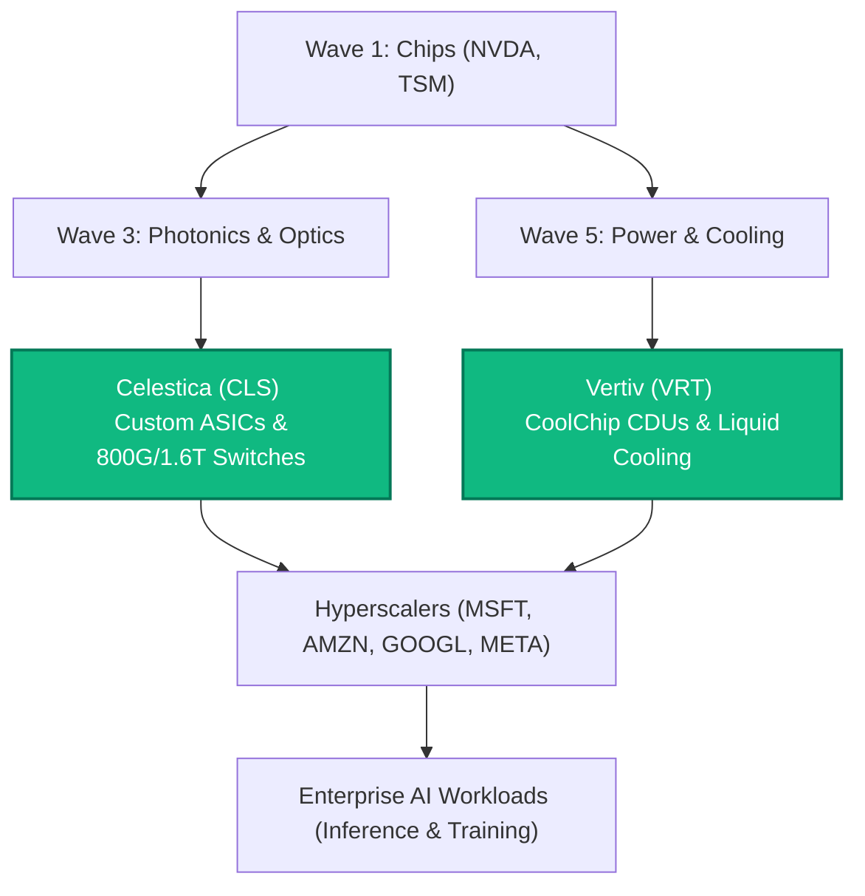

# 📊 Celestica (CLS) & Vertiv (VRT) Deep-Dive Analysis Dashboard
> **Universal Investment SOP v4.5 Audit · Dynamic-Date (2026) · Confidential**
> วิเคราะห์เจาะลึก 2 หุ้นแกนหลักในห่วงโซ่คุณค่าดาต้าเซ็นเตอร์ตามหลักการวิเคราะห์ 7 มิติ (7-Dimension Master SOP)

---

## 1. Executive Summary & Value Chain Mapping

ในการสร้างโครงสร้างพื้นฐาน AI ปี 2026 เงินทุนจะเคลื่อนย้ายตามกฎ **8-Wave Flow** เพื่อแก้ไขคอขวดเชิงกายภาพ (Physical Bottlenecks) บนโลกความจริง ซึ่งทั้งสองบริษัทอยู่ในกลุ่มต้นน้ำที่มีอำนาจการต่อรองสูง:



*   **Celestica (CLS):** ครองตำแหน่ง Wave 3 & 6 (Photonics, Networking & Compute Hardware) แปลงชิป AI ให้กลายเป็นเซิร์ฟเวอร์แบบแร็คและระบบสวิตชิ่งความเร็วสูงเพื่อส่งมอบให้ Hyperscalers
*   **Vertiv (VRT):** ครองตำแหน่ง Wave 5 (Power & Thermal Management) แก้ไขคอขวดเรื่องความร้อนระดับ 120kW+ ต่อตู้แร็คด้วยระบบระบายความร้อนด้วยของเหลวแบบปิด

---

## 2. Celestica Inc. (NYSE: CLS) — 7-Dimension Master SOP Audit

### Dimension 1 — Megatrend & Global Macro
*   **AI Super Cycle Stage:** Stage 2 (Infrastructure Expansion) และ Stage 4 (Enterprise AI Hardware Integration)
*   **Macro Correlation:** มีความสัมพันธ์ระดับสูงกับงบการลงทุน (Hyperscaler CapEx) ของบริษัทบิ๊กเทค สภาวะดอกเบี้ยสูงส่งผลต่อต้นทุนการตั้งโรงงานขยายฐานผลิตใหม่ในเท็กซัสและไทย

### Dimension 2 — Moat & Industry Position (SWOT - Strengths & Opportunities)
*   **Moat:** การร่วมออกแบบบอร์ดและระบบเครือข่ายความเร็วสูง (Co-design) ร่วมกับ Hyperscalers ทำให้เกิด **High Customization Lock-in** ลูกค้าไม่สามารถเปลี่ยนผู้ผลิตได้ง่ายเนื่องจากมีความซับซ้อนของสิทธิบัตรและการทดสอบมาตรฐานความเสถียร
*   **Strengths:** กลุ่มธุรกิจ CCS (Connectivity & Cloud Solutions) สร้างสวิตช์ 800G และระบบจัดเก็บข้อมูลความหนาแน่นสูงที่ช่วยเพิ่มขีดความสามารถการเทรนโมเดล AI
*   **Opportunities:** การขยายพื้นที่การผลิตในพื้นที่ต้นทุนต่ำที่มีฝีมือแรงงานสูง เช่น ประเทศไทย และการเติบโตของความต้องการสวิตช์ระดับ 1.6T ในครึ่งปีหลังของ 2026

### Dimension 3 — Financials & Earnings Intelligence
*   **Piotroski F-Score:** **7 / 9** (ผ่านเกณฑ์ระดับสูง สะท้อนถึงการเติบโตของกำไรและประสิทธิภาพสินทรัพย์ที่เพิ่มขึ้น)
*   **Altman Z-Score:** **7.45** (Safe Zone แข็งแกร่ง โอกาสล้มละลายต่ำมาก)
*   **FCF & CapEx Realities:** คาดการณ์ Free Cash Flow ปี 2026 อยู่ที่ **500 ล้านดอลลาร์** โดยมีงบลงทุน (CapEx) สูงถึง **1.0 พันล้านดอลลาร์** เพื่อขยายสายการผลิต ส่งผลให้อัตราแปลง FCF ต่ำลงชั่วคราว
*   **Growth Outlook:** คาดการณ์รายได้ปี 2026 สูงขึ้นเป็น **1.9 หมื่นล้านดอลลาร์** และ Adj. EPS เพิ่มเป็น **$10.15 ต่อหุ้น**

### Dimension 4 — Sentiment & Whale Intelligence
*   **Whale Holdings:** ได้รับการบรรจุเข้าสู่พอร์ต ETF กลุ่มโครงสร้างพื้นฐานระดับบน และมีแรงซื้อสะสมจากกองทุนขนาดใหญ่ในช่วงไตรมาสแรกของปี
*   **Short Interest:** ต่ำ (ต่ำกว่า 3%) สะท้อนถึงความเชื่อมั่นของตลาดต่อทิศทางบริษัท

### Dimension 5 — Advanced Technical Analysis (D1/W1)
*   **W1 Health Check:** ผ่านระบบ Golden Filter (ราคายังยืนเหนือเส้น Weekly 200 EMA อย่างมั่นคง)
*   **D1 Setup:** ราคาอยู่ในช่วงย่อตัวสะสมกำลังใต้เส้น MA 50 ทำท่าสร้างกรอบ Flag บริเวณราคา **`$330.00 – $340.00`** รอแท่งเทียนยืนยันแรงซื้อกลับเพื่อประเมินจุดคุ้มทุน (R/R >= 1:2)

### Dimension 6 — Devil's Advocate & Risks (SWOT - Weaknesses & Threats)
1.  **Extreme Customer Concentration (จุดตายสำคัญ):** ลูกค้า 3 รายแรกคิดเป็นสัดส่วนรายได้สูงถึง **65%** ของรายได้ทั้งหมด (และลูกค้า 10 รายแรกคิดเป็น **80%**) การสูญเสียลูกค้ารายใดรายหนึ่งจะกระทบมูลค่าหุ้นทันที
2.  **Margin Compression Risk:** ธุรกิจ EMS แบบดั้งเดิมมีจรรยาบรรณมาร์จิ้นต่ำ แม้บริการ CCS จะมีอัตรากำไรดีกว่า แต่ถ้าเกิดสงครามราคาในกลุ่ม OEM มาร์จิ้นจะถูกกดดันทันที
3.  **Upcoming Earnings Catalyst Risk:** ผลประกอบการ Q2 กำลังจะประกาศในวันที่ **27 กรกฎาคม 2026** ถือเป็นความเสี่ยงระยะสั้นที่อาจทำให้ราคาเกิดช่องว่างขาลง (Gap Down) หากผลงานหรือทิศทางการเติบโตของยอดขายต่ำกว่าคาด

### Dimension 7 — Thesis Integrity & Trade Plan
*   **Thesis:** ตราบใดที่ Microsoft/Amazon ไม่ลดงบลงทุนด้าน AI และความต้องการสวิตช์ 800G ยังเติบโต CLS จะยังคงเติบโตต่อไปในฐานะผู้อยู่เบื้องหลังห่วงโซ่นี้

```text
========================================================================================
[TRADE TICKET: CLS]
----------------------------------------------------------------------------------------
Thesis Integrity : 🟢 PASS (สัญญารับจ้างขยายตัวต่อเนื่องตามงบ Hyperscalers)
Entry Zone       : $330.00 – $340.00 (รอสัญญาณ Daily Rebound)
Stop-Loss        : $310.00 (Hard Stop-Loss คำนวณจาก ATR)
Target 1 (50%)   : $385.00 (R/R 1:2.0 ล็อคกำไรแรก)
Target 2 (50%)   : $440.00 (Fibonacci Extension)
Position Size    : ไม่เกิน 5% ของ Liquidity ในพอร์ตเทรดระยะสั้น (จำกัดขนาดก่อนงบการเงินออก)
========================================================================================
```

---

## 3. Vertiv Holdings Co. (NYSE: VRT) — 7-Dimension Master SOP Audit

### Dimension 1 — Megatrend & Global Macro
*   **AI Super Cycle Stage:** Stage 2 (Infrastructure Expansion - ด่านป้องกันระดับความร้อนกายภาพ)
*   **Macro Correlation:** การเชื่อมต่อไฟฟ้าและโครงการก่อสร้างโรงไฟฟ้าพลังงานสะอาดเป็นปัจจัยหลักในการหนุนตลาดดาต้าเซ็นเตอร์ ซึ่งเป็นประโยชน์ทางตรงกับระบบจัดการพลังงานของ Vertiv

### Dimension 2 — Moat & Industry Position (SWOT - Strengths & Opportunities)
*   **Moat:** **High Switching Cost & Validation Moat** การเปลี่ยนผู้ผลิตระบบทำความเย็นในดาต้าเซ็นเตอร์ระดับ Hyperscale ต้องใช้เวลาตรวจสอบความปลอดภัย 6-12 เดือน และมีต้นทุนการสูญเสียโอกาสมหาศาล หากเกิดความเสียหายชิป AI มูลค่าร้อยล้านจะเสียหายทันที นอกจากนี้ VRT ยังเป็นพันธมิตรร่วมออกแบบระบบมาตรฐาน (Reference Design) กับชิป NVIDIA GB200
*   **Strengths:** กลุ่มผลิตภัณฑ์ **CoolChip (CDU 2300, CDU 600)** ครอบคลุมความหนาแน่นระดับเมกะวัตต์จนถึงระดับตู้แร็ค มีการควบคุมแรงดันและอุณหภูมิของสารทำความเย็นอย่างแม่นยำสูง
*   **Opportunities:** การเติบโตของการขยายฐานการผลิตไปสู่ภูมิภาคเอเชียแปซิฟิกและการเริ่มเปลี่ยนผ่านไปสู่ระบบระบายความร้อนด้วยของเหลวแบบสมบูรณ์แทนระบบพัดลมในศูนย์ข้อมูลเก่า

### Dimension 3 — Financials & Earnings Intelligence
*   **Piotroski F-Score:** **5 / 9** (ผ่านเกณฑ์ขั้นต่ำ อยู่ในเกณฑ์กลางค่อนไปทางดี สะท้อนการประคองระดับงบการเงินขณะเร่งขยายการลงทุน)
*   **Altman Z-Score:** **5.61 – 9.24** (Safe Zone แข็งแกร่งมาก สะท้อนโครงสร้างหนี้สินต่อทุนที่ต่ำหลังจากการจัดอันดับระดับ Investment Grade)
*   **FCF & Margin Performance:** โดดเด่นด้วยอัตรา FCF Margin สูงระดับ **21.0%** ซึ่งสูงที่สุดในกลุ่มเครื่องจักรอุตสาหกรรม
*   **Growth Outlook:** ขยับ Adj. EPS ขึ้นสู่ช่วงกึ่งกลางระดับ **$6.35ต่อหุ้น**

### Dimension 4 — Sentiment & Whale Intelligence
*   **ETF Reverse-Engineering:** เป็นหนึ่งในสินทรัพย์หลัก 5 อันดับแรกของกองทุนที่เน้นลงทุนด้านพลังงานสะอาดและโครงสร้างพื้นฐาน AI (เช่น SMH, SOXX, ไฮบริดฟันด์ต่าง ๆ)
*   **Whale activity:** มีบันทึกข้อมูล Dark Pool Block Order เข้าซื้อประคองราคาในช่วงปรับตัวลดลงตามแนวรับระยะกลาง

### Dimension 5 — Advanced Technical Analysis (D1/W1)
*   **W1 Health Check:** ผ่านระบบ Golden Filter (เทรนด์หลักขาขึ้นชัดเจนเหนือ Weekly 200 EMA)
*   **D1 Setup:** ราคาฟื้นตัวขึ้นมาระยะสั้นสู่ $318.47 ทว่าราคายังเคลื่อนไหวอยู่ใต้เส้น MA 50 และมีแนวต้านจิตวิทยาที่ $330 ควรรอให้มีการทดสอบสร้างฐานที่ราคากรอบ **`$290.00 – $300.00`** เพื่อลดอัตราความสูญเสียหากตลาดโดยรวมปรับฐาน

### Dimension 6 — Devil's Advocate & Risks (SWOT - Weaknesses & Threats)
1.  **Astronomical Valuation Multiple (ความเสี่ยงราคาแพง):** หุ้นซื้อขายที่ P/E ระดับ **75x+** ซึ่งไม่มีพื้นที่รองรับความผิดพลาดแม้เพียงเล็กน้อย หากคาดการณ์การขยายตัวชะลอตัวลง ราคาจะถูกปรับฐานอย่างหนัก
2.  **Liquid Cooling Alternatives:** คู่แข่งในกลุ่มพลังงานและทำความเย็นขนาดใหญ่ (เช่น Eaton, Modine, nVent) กำลังเร่งพัฒนา CDU ราคาประหยัดเพื่อเจาะส่วนแบ่งตลาด Colocation
3.  **Core Components Shortage:** ความเสี่ยงในการจัดหาชิ้นส่วนเฉพาะ เช่น วาล์วควบคุมแรงดันและตัวปั๊มสารเหลวชนิดพิเศษที่ผลิตได้จำกัด อาจทำให้ยอดส่งมอบงานในไตรมาสหลังช้ากว่าแผน

### Dimension 7 — Thesis Integrity & Trade Plan
*   **Thesis:** ดาต้าเซ็นเตอร์ AI รุ่นใหม่ไม่สามารถเปิดทำงานได้หากไม่มีระบบระบายความร้อนด้วยของเหลว และ Vertiv คือเจ้าของสิทธิบัตรการออกแบบแร็คร่วมกับผู้ชนะอย่าง NVIDIA

```text
========================================================================================
[TRADE TICKET: VRT]
----------------------------------------------------------------------------------------
Thesis Integrity : 🟢 PASS (ความต้องการด้านการทำความเย็นเติบโตเป็นเงาตามชิป AI)
Entry Zone       : $290.00 – $300.00 (รอราคาดึงตัวกลับทดสอบแนวรับ Daily MA 50)
Stop-Loss        : $265.00 (ต่ำกว่าแนวรับ Pivot ล่าง)
Target 1 (50%)   : $355.00 ( R/R = 1:2.0 ล็อคความเสี่ยงพอร์ต)
Target 2 (50%)   : $379.00 (เป้าหมายทดสอบ High เดิม)
Position Size    : ไม่เกิน 7.5% ของพอร์ตเทรดระยะสั้น (มีกระแสเงินสดอิสระคุ้มครองความผันผวน)
========================================================================================
```

---

## 4. Competitive Moat & Hyperscaler Custody Matrix

ในการเลือกลงทุนแบบ Swing Trade ของทั้งสองบริษัท มีความแตกต่างในเชิงโครงสร้างธุรกิจและคูเมืองป้องกันตนเองที่ต้องทำความเข้าใจ:

| หัวข้อเปรียบเทียบ | Celestica (CLS) | Vertiv (VRT) |
| :--- | :--- | :--- |
| **ตำแหน่งในห่วงโซ่** | Hardware Enabler & OEM Switching (Wave 3/6) | Power & Thermal Infrastructure (Wave 5) |
| **คูเมืองทางธุรกิจ (Moat)** | ปานกลาง (พึ่งพาลิขสิทธิ์ร่วมและสัญญาจ้างระยะกลาง) | สูงมาก (High Switching Costs และ NVIDIA Integration) |
| **ความผันผวนอัตรากำไร** | ผันผวนตามต้นทุนฮาร์ดแวร์และการผลิต | มั่นคงและสูงกว่า (FCF Margin 21% จากสัญญาระดับโครงสร้าง) |
| **ความเข้มข้นของลูกค้า** | สูงมาก (บิ๊กเทค 3 รายครองรายได้ 65%) | ปานกลาง-สูง (กระจายตัวไปตามผู้สร้างดาต้าเซ็นเตอร์ทั่วโลก) |
| **การควบคุมความเสี่ยง** | ⚠️ ระวังการเปลี่ยนผ่านเทคโนโลยีชิปและการย้ายฐานจ้างผลิต | ⚠️ ระวังระดับมูลค่าประเมิน (Valuation) ที่อยู่ในเกณฑ์แพงมาก |
